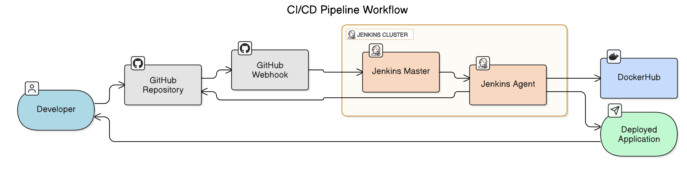

<h2 align="center">
  
</h2>
---

  

---

## 🔧 Project Overview

Built a fully automated **CI/CD pipeline** for deploying a containerized **Notes App** using Jenkins on **AWS EC2** — with pipelines managed via **GitHub**, triggered through **webhooks**, and modularized with shared **Groovy libraries**. All jobs run on a dedicated **Jenkins agent** node for enhanced security and performance.

---

## 🎯 Key Highlights

✅ 📁 **Pipeline as Code (Jenkinsfile in GitHub)**  
- The entire pipeline logic is stored in GitHub.  
- Jenkins uses *Pipeline Script from SCM* to dynamically fetch and run the Jenkinsfile.

✅ 🔁 **Auto Trigger via GitHub Webhook**  
- Configured a webhook to trigger Jenkins builds on every push to the repo.  
- Enables real-time CI/CD on every code change.

✅ 🔧 **Jenkins Agent Node**  
- Set up a dedicated EC2 worker node.  
- All builds and deployments are executed on the agent for isolation and scalability.

✅ 📦 **Deployment of Notes App (Dockerized)**  
- The pipeline builds the Notes App into a Docker image.  
- Authenticated Docker Hub push via Jenkins credentials.  
- Ready-to-run containers on any environment.

✅ 🧱 **Modular Pipeline with Shared Libraries**  
- Reused custom Groovy scripts (from another GitHub repo’s `vars/` folder).  
- Integrated via Global Shared Libraries using `@Library`.  
- Achieved clean, DRY, and reusable pipeline stages (clone, build, push, etc.).

---

## 🛠️ Stack

**Jenkins** • **GitHub** • **Docker** • **DockerHub** • **Groovy** • **Shell** • **AWS EC2**

---

## 📌 Outcome

A **secure, scalable**, and **production-ready** CI/CD pipeline that builds and deploys a Dockerized Notes App using **best practices** in Jenkins automation.

---

## 🧠 Skills Showcased

`GitHub` • `CI/CD Pipelines` • `Amazon EC2` • `Jenkins` • `Groovy` • `Automation` • `Docker` • `DockerHub` • `Docker-Compose`
